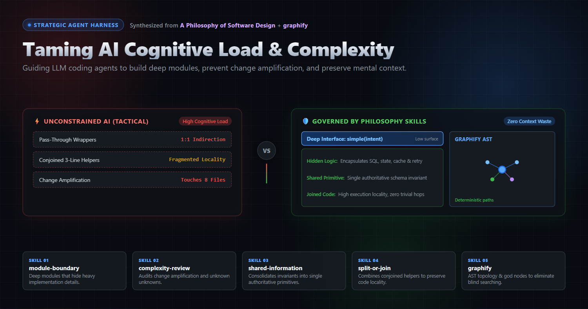
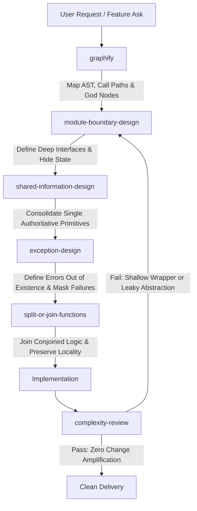

# Philosophy of Lowering Complexity Skills

<p align="center">
  
</p>

A collection of agent skills derived from John Ousterhout's *A Philosophy of Software Design* alongside **graphify**, engineered to constrain software complexity, eliminate shallow abstractions, and manage cognitive load when collaborating with AI coding agents.
<p align="center">
  
</p>
---

## The AI Complexity Crisis: Why These Skills Exist

Generative AI reduces the marginal cost of writing code to near zero. However, software engineering costs are dominated by **reading, understanding, and modifying code**, not typing it.

When AI writes code unconstrained, it optimizes for the fastest local patch ("tactical programming"):
- **Context Fragmentation:** LLMs follow rigid clean-code dogmas, scattering simple logic across dozens of 3-line single-use helper functions.
- **Shallow Abstractions:** LLMs routinely introduce pass-through wrappers, boilerplate adapters, and anemic service layers that leak implementation details while adding indirection.
- **Information Duplication:** Agents generate duplicate parsing, repeated data structures, and desynchronized invariants across files because they lack global memory of prior decisions.
- **Exploding Cognitive Load:** Developers and subsequent agent runs must load entire webs of shallow indirection into limited context windows just to trace a single business operation.

These skills invert the default bias of AI agents: forcing **deep modules**, **unified shared primitives**, **high locality**, and **verifiable structural grounding**.

---

## Skills Breakdown

### 1. `module-boundary-design`
*Based on Chapters 4, 5, 7, and 9: Deep Modules, Information Hiding, and Somewhat General-Purpose Interfaces.*

- **Core Principle:** Deep modules provide powerful functionality through simple, cohesive interfaces while concealing substantial implementation complexity.
- **Why It Matters for AI:** LLMs naturally generate "shallow modules"—classes or functions where the interface complexity approaches the implementation complexity (e.g., pass-through services, 1:1 controller-to-service wrappers). This skill forces the agent to hide mechanics (protocols, internal state, retry logic, persistence formats) behind simple, intent-oriented boundaries, reducing the token cost and mental effort required by callers.

### 2. `complexity-review`
*Based on Chapters 2 and 3: Nature of Complexity and Strategic vs. Tactical Programming.*

- **Core Principle:** Complexity is anything that makes software hard to understand or modify ($C = \sum c_p t_p$). It manifests as Change Amplification, Cognitive Load, and Unknown Unknowns.
- **Why It Matters for AI:** AI models act as "tactical tornadoes"—they make changes quickly to satisfy the immediate prompt, leaving behind architectural debt that requires future changes to touch 10 different files. This skill provides an automated audit gate to detect shallow wrappers, abstraction leaks, concept budget violations, and change amplification before code is accepted.

### 3. `shared-information-design`
*Based on Chapters 5 and 9: Information Hiding and Shared Knowledge Representation.*

- **Core Principle:** Knowledge that is shared across multiple modules must be consolidated into a single authoritative primitive rather than duplicated across callers.
- **Why It Matters for AI:** Independent prompts and parallel agent execution frequently lead to duplicated validation, repeated schema parsing, and synchronized state held in multiple places. When a requirement changes, one location is updated while others rot. This skill forces agents to identify shared invariants and extract deep, authoritative primitives that encapsulate data layouts and business rules.

### 4. `split-or-join-functions`
*Based on Chapter 9: Better Together or Better Apart?*

- **Core Principle:** Functions should be split only when doing so isolates independent, general-purpose sub-tasks. Fragmenting tightly coupled sequential logic into conjoined single-use helpers inflates cognitive load and obscures data flow.
- **Why It Matters for AI:** LLMs are conditioned on rules like "functions must not exceed 10–20 lines." In practice, this produces fragmented codebases where readers must mentally reconstruct call trees across five functions just to understand one linear algorithm. This skill guides the agent to join conjoined methods, keep sequential logic together, and preserve context locality.

### 5. `exception-design`
*Based on Chapter 10: Define Errors Out of Existence.*

- **Core Principle:** Design error semantics so callers handle the smallest possible number of exceptional conditions: define errors out of existence, mask recoverable failures, aggregate at boundaries, and fail fast on corruption.
- **Why It Matters for AI:** AI models tend to over-handle exceptions by creating granular custom exception hierarchies and scattering `try/catch` boilerplate across callers, or alternatively, by letting low-level transport/SDK exceptions leak through domain boundaries. This skill forces agents to design error semantics intentionally—turning exceptions into normal cases, handling recoverable errors internally, and aggregating failure modes at clean architectural boundaries.

### 6. `graphify`
*Structural Codebase Intelligence and Knowledge Graph Construction.*

- **Core Principle:** Deterministic extraction and query of codebase topology, dependency graphs, god nodes, and call paths.
- **Why It Matters for AI:** When navigating non-trivial codebases, AI agents waste tokens and context window capacity through probabilistic grep searches and ungrounded file browsing. `graphify` builds a persistent AST-backed knowledge graph with community detection. It allows agents to trace call paths, evaluate blast radiuses, identify god-node coupling, and understand system boundaries deterministically before editing.
---

## Agent Workflow Pipeline

How these six skills interlock during an autonomous agent coding session:


---

## Structure

```text
.
├── AGENTS.md                  # Global execution policy, design rules & OMP harness configs
├── complexity-review/          # Complexity auditing and change amplification detection
│   └── SKILL.md
├── exception-design/           # Error semantics, masking, and boundary aggregation
│   └── SKILL.md
├── module-boundary-design/     # Deep module architecture and information hiding
│   ├── references/
│   └── SKILL.md
├── shared-information-design/  # Shared primitive design and invariant consolidation
│   ├── references/
│   └── SKILL.md
├── split-or-join-functions/    # Complexity-based function sizing and inlining
│   └── SKILL.md
└── graphify/                   # Knowledge graph generation and structural codebase query
    ├── references/
    └── SKILL.md
```
---

## Usage

Compatible with agent harnesses supporting the standard skill specification (Oh My Pi, Claude Code, etc.):

- Copy or symlink any skill directory into your harness's skills folder (e.g. `~/.omp/agent/skills/` or `.omp/skills/`).
- Invoke the skill during design, implementation, or code review phases to enforce architectural quality on AI-generated pull requests and code modifications.
- See [AGENTS.md](./AGENTS.md) for the global agent execution policy, Ousterhout software-design complexity rules, and recommended Oh My Pi harness configuration (`config.yml` and `APPEND_SYSTEM.md`).
